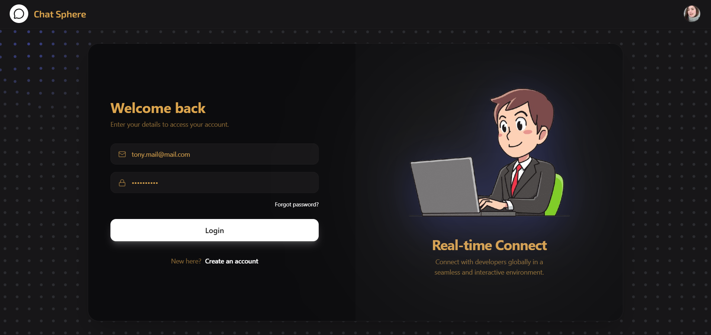
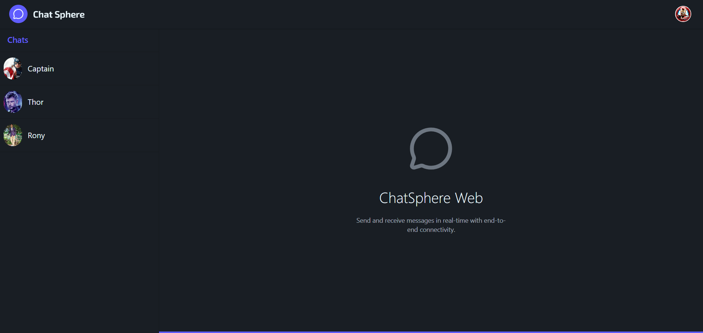
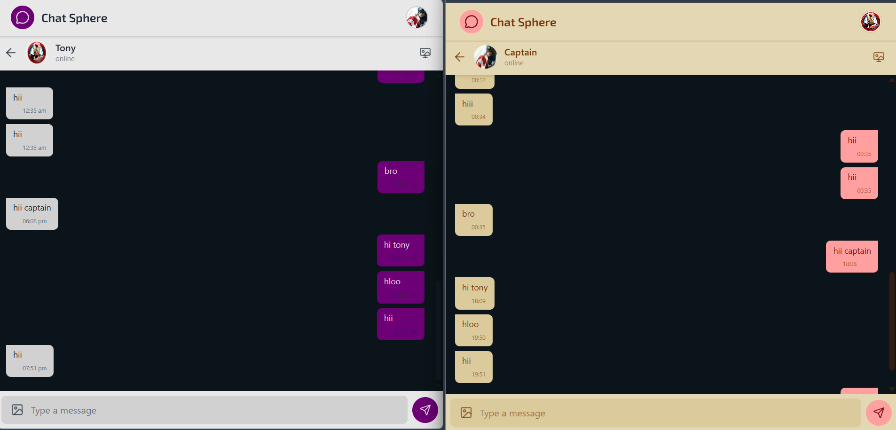
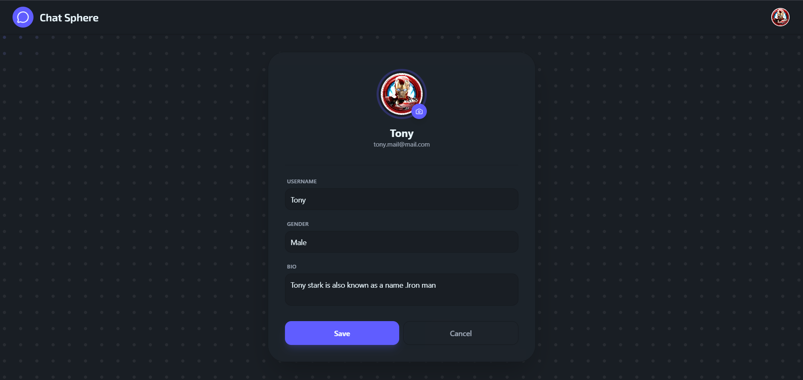
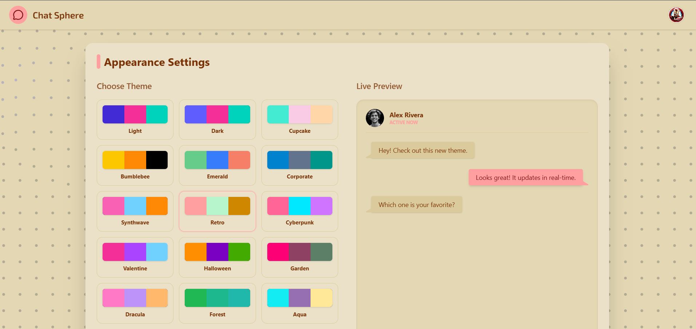

# ChatAPP - Real-Time Chat Application

A full-stack real-time chat application built with the **MERN stack** (MongoDB, Express.js, React, Node.js) and **Socket.io** for instant messaging. Features user authentication, profile management, and live chat with online status updates.

---

## 📸 Screenshots

### Login Page



### Main Chat Interface



### Chat Conversation



### Profile Page



### Settings Page



---

## 🚀 Quick Start

### Prerequisites

- **Node.js** (v16+ recommended)
- **MongoDB** (local or cloud instance like MongoDB Atlas)
- **npm**

### 1) Clone the repository

```bash
git clone https://github.com/Abinashrout244/ChattAPP.git
cd ChattAPP
```

### 2) Setup Backend

```bash
cd backend
npm install
# Create .env file with required variables (see backend/README.md)
npm run dev  # Runs on http://localhost:5000
```

### 3) Setup Frontend (in a new terminal)

```bash
cd ../frontend
npm install
npm run dev  # Runs on http://localhost:5173
```

### 4) Access the app

- Frontend: http://localhost:5173
- Backend API: http://localhost:5000

---

## 🗂️ Project Structure

```
ChatAPP/
├── backend/                  # Node.js + Express API server
│   ├── src/
│   │   ├── app.js            # Express app + Socket.io
│   │   ├── config/           # DB + Cloudinary config
│   │   ├── controllers/      # Route handlers (auth, messages)
│   │   ├── middlewares/      # Auth + socket middlewares
│   │   ├── model/            # Mongoose schemas
│   │   ├── routes/           # API routes
│   │   └── utils/            # Helpers (socket, validation)
│   ├── .env                  # Environment variables
│   ├── package.json
│   └── README.md             # Backend-specific docs
├── frontend/                 # React + Vite client
│   ├── src/
│   │   ├── components/       # UI components (chat, layout, ui)
│   │   ├── pages/            # Route pages (Home, Login, Profile, Settings)
│   │   ├── redux/            # State management (user, chat slices)
│   │   ├── routes/           # Protected routes
│   │   ├── socket/           # Socket.io client
│   │   ├── styles/           # Global CSS
│   │   └── utils/            # Constants + helpers
│   ├── public/               # Static assets
│   ├── .env                  # Optional env vars
│   ├── package.json
│   ├── vite.config.js
│   └── README.md             # Frontend-specific docs
├── screenshots/              # App screenshots
└── README.md                 # This file
```

---

## 🛠️ Tech Stack

### Backend

- **Node.js** + **Express.js** — Server framework
- **MongoDB** + **Mongoose** — Database + ODM
- **Socket.io** — Real-time communication
- **JWT** — Authentication tokens
- **bcryptjs** — Password hashing
- **Cloudinary** — Image uploads (optional)
- **Multer** + **Sharp** — File handling

### Frontend

- **React** (v19) — UI library
- **Vite** — Build tool + dev server
- **Redux Toolkit** — State management
- **React Router v7** — Client-side routing
- **Socket.io Client** — Real-time updates
- **Axios** — HTTP requests
- **Tailwind CSS** + **DaisyUI** — Styling
- **Framer Motion** + **GSAP** — Animations
- **Three.js** + **@react-three/fiber** — 3D effects

---

## 🔑 Key Features

- ✅ **User Authentication** — Login/logout with JWT + cookies
- ✅ **Real-Time Chat** — Instant messaging with Socket.io
- ✅ **Profile Management** — Edit profile, upload images
- ✅ **Online Status** — See who's online/offline
- ✅ **Responsive UI** — Works on desktop + mobile
- ✅ **Protected Routes** — Auth-required pages
- ✅ **Message History** — Persistent chat logs

---

## 🔌 API Endpoints

### Authentication

- `POST /api/auth/login` — Login
- `POST /api/auth/logout` — Logout
- `GET /api/auth/user` — Get current user
- `PUT /api/auth/profile-edit` — Update profile

### Messaging

- `GET /api/msg/allUser` — List all users
- `GET /api/msg/receive/:userId` — Get chat with user
- `POST /api/msg/send/:userId` — Send message

> Full API docs in `backend/README.md`

---

## 🧭 How It Works

### Authentication Flow

1. User logs in via frontend → calls `POST /api/auth/login`
2. Backend validates credentials, sets JWT cookie
3. Frontend stores user in Redux, redirects to chat

### Chat Flow

1. Frontend connects to Socket.io on login
2. User selects a chat → loads messages from API
3. Sending a message → API saves to DB + broadcasts via Socket.io
4. Recipients receive real-time updates

---

## 🛠️ Development Notes

- **Environment Variables**: See `backend/README.md` for required `.env` keys
- **CORS**: Backend allows frontend origin with credentials
- **Database**: Uses MongoDB; ensure connection string is set
- **File Uploads**: Optional Cloudinary integration for profile pics
- **Linting**: Frontend uses ESLint; run `npm run lint`

---

## 📌 Commands

### Backend

```bash
cd backend
npm install
npm run dev    # Development (with nodemon)
npm start      # Production
```

### Frontend

```bash
cd frontend
npm install
npm run dev    # Development server
npm run build  # Production build

```

---

## 🤝 Contributing

1. Fork the repo
2. Create a feature branch
3. Make changes, test locally
4. Submit a PR

---

# _Built by Abinash Rout_
